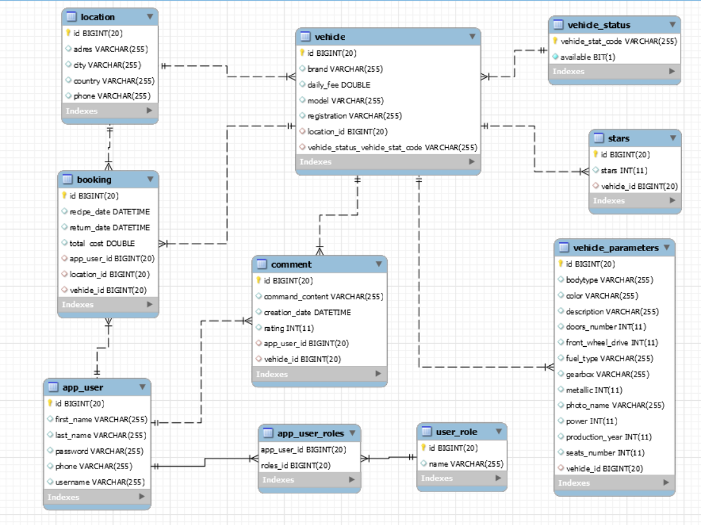

# RentCar (In progress)

This application is used to service car rental companies. It allows registering and logging users (Spring Security), making car reservations, browsing reservations, managing rentings , users or vehicles by authorized persons.

## Backend
Restowe API napisane w Springu z wykorzystaniem następujących technologii:

* Spring MVC
* Spring Security
* Spring Data JPA
* Hibernate

## Frontend

* Thymeleaf
* Bootstrap
* HTML, CSS

## Database

### Tabele:
Baza danych składa się z 10 tabel:

* Bookings – tabela przechowująca rezerwacje aut.
* Locations – tabela przechowująca lokalizacje wypożyczalni aut.
* Users – tabela zawierająca dane użytkowników.
* AppUsersRoles – tabela zawierająca przypisania poszczególnym użytkownikom określonych ról.
* UserRoles – tabela zawierająca role przypisywane użytkownikom
* Vehicles – tabela zawierająca podstawowe dane pojazdów.
* VehicleParameters – tabela zawierająca większą liczbę danych pojazdów.
* VehicleStatus – tabela słownikowa przechowująca status pojazdów.
* Comments – tabela przechowująca komentarze na temat pojazdów.
* Stars – tabela przechowująca oceny pojazdów.
